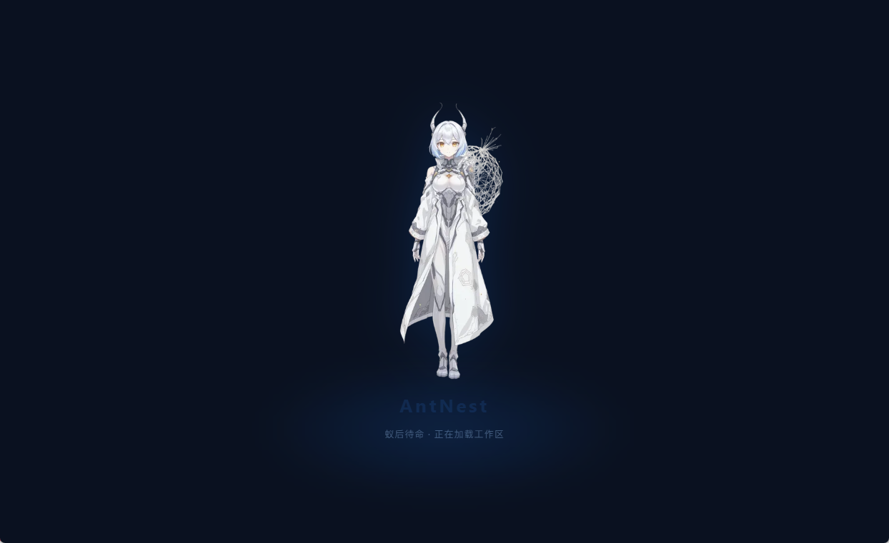
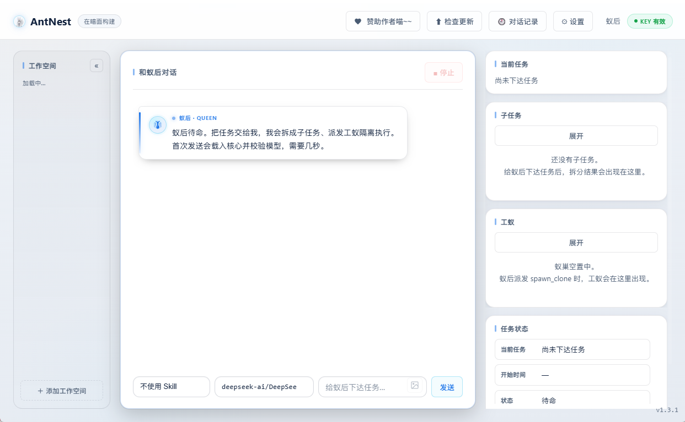
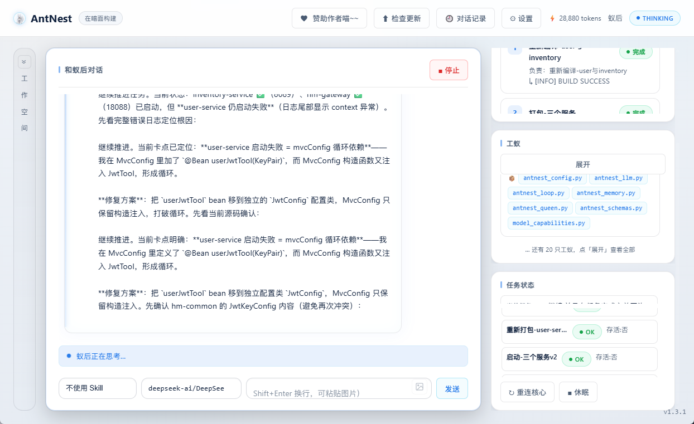
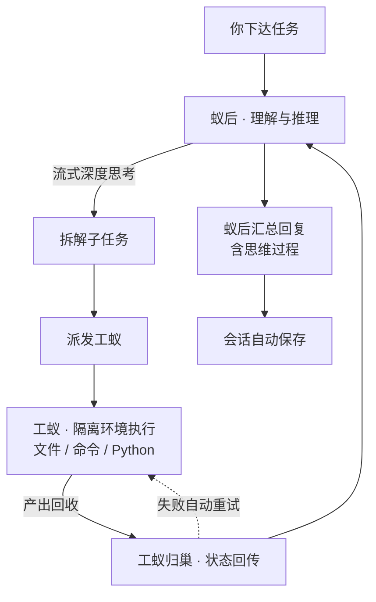

<div align="center">


# AntNest · 蚁巢

**本地运行 · 蚁后/工蚁架构 · 深度思考实时可见 · 全程掌控本机**

你的 AI，你的电脑，你的规则。

[](https://github.com/llxpy/AntNest/releases)
[](https://github.com/llxpy/AntNest/actions)
[](https://github.com/llxpy/AntNest)
[](https://github.com/llxpy/AntNest)
[](LICENSE)
[](https://www.python.org/)
[](https://github.com/llxpy/AntNest/releases)

</div>

---

## 📌 这是什么

**AntNest（蚁巢）是一个跑在本机的 AI Agent 桌面应用。** 它用「蚁后 + 工蚁」架构把复杂任务拆成子任务，派给隔离环境中的工蚁真正操作你的电脑——蚁后负责思考、规划与决策，工蚁负责动手执行。

- **本地优先**：全部数据与操作留在本机，模型通过 OpenAI 兼容接口接入（DeepSeek / MiniMax / Kimi / OpenAI / Ollama 等）。
- **不是聊天玩具，是干活的手**：文件读写、代码工程、系统管理、网络诊断、命令执行——只要命令能做的事，交给蚁后就能做。
- **透明可控**：蚁后每一步的「深度思考」实时流式可见，绝不黑盒。

---

## 📸 界面预览

启动立绘、主界面与运行中的任务监控：

<p align="center">
  
  <br/>
  
  <br/>
  
</p>

---

## 🏗 架构：为什么是「蚁后 / 工蚁」



| 角色 | 职责 | 隔离 |
|---|---|---|
| **蚁后** | 理解任务 → 推理拆解 → 派发决策 → 汇总回复 | 主进程，不直接跑命令 |
| **工蚁** | 在隔离目录执行文件 / 命令 / Python，产出后销毁 | 独立进程 + 临时目录 |

分工带来三件事：**安全**（危险命令过滤、工蚁只在临时巢穴动土）、**并行**（一层最多 10 只工蚁，层级 2→5→3）、**恢复**（失败自动重试一次；强停后保存决策摘要，下一轮先理解"为什么停"再继续）。

---

## ✨ 核心能力

### 💻 本地掌控
- 读文件 / 列目录 / 全文检索 / 写入文件 / 搜索替换 —— 本地代码工程日常全覆盖
- 工蚁隔离执行 Python / shell，产出文件自动收回归档
- 网络诊断、系统管理、进程与服务控制（管理员模式可执行系统级操作）

### 🧠 深度思考 · 全程可见
- 任务进行中**实时流式显示「深度思考」**（逐字填充，小卡片内滚动）
- 回复正文随文本长度自适应，长文不被截断
- 每条回复保留思考过程，随时回看蚁后为什么这么做

### 🗄 记忆
- **B+ 树思想索引 + RAG 检索**的记忆层（`memory_tree.py`）
- 每轮自动检索 NEST.md / hints.md 相关段落注入上下文
- 动态用户画像 / 行为偏好 / 停止快照恢复，跨会话持续演进

### 👑 Agent 自律
- 连续 3 次相同工具+相同参数 → 注入**《自我反思》**指引换一种方法继续，不再卡死中断
- thinking 重复自动打断擦除；单任务最大轮次兜底；工具格式错误自动纠正
- 模型能力画像：按 `/models` 实测校准上下文上限并注入系统提示词

### 🎨 UI / 体验
- 主题：黑色 / 白色 / 自定义色（统一设计 token）
- 右下**结构化任务状态卡**：当前任务、开始时间、工蚁创建与存活
- 子任务 / 工蚁「展开」卡片总览，长路径自动换行、任务多不卡顿
- 左侧**工作空间栏**：保存常用目录、点击预览文件、一键切换（可折叠）
- 对话记录：只读「查看」历史（含思维过程）、恢复上下文、删除
- 对话框内直接切换 Skill / 模型；启动立绘 splash 一次登场

---

## 🚀 快速开始

### 方式一：安装包（推荐）
从 [**Releases**](https://github.com/llxpy/AntNest/releases) 下载 `AntNest-Setup.exe`，单用户安装到 `%LOCALAPPDATA%\AntNest`，**无需管理员权限**。

```powershell
# 下载后运行安装包即可；首次运行自动用 uv 拉取依赖（需联网）
```

### 方式二：便携（开发 / 二次开发）
```bash
git clone https://github.com/llxpy/AntNest.git
cd AntNest
uv run python prototype_antnest.py
```

### 方式三：直接启动
仓库根目录运行 `AntNest.exe`（编译好的 GUI 启动器，零配置）。

> **首次使用**：打开「⚙ 设置」填入 API Base URL / 模型 / Key，点「保存并校验」，即可开始下达任务。

---

## 🔌 支持的模型服务

| 服务 | 说明 |
|---|---|
| DeepSeek | 深度思考（reasoning）原生支持，thinking_mode=auto |
| MiniMax | 推理快，建议 thinking_mode=auto/off |
| Kimi / Moonshot | 优化参数推荐 |
| OpenAI | 标准接口 |
| Ollama / 本地端点 | 任意 OpenAI 兼容服务 |

---

## 🛡 安全模型（纵深防御）

| 层 | 保护 | 可配置 |
|---|---|---|
| 命令过滤 | 正则拦截危险模式（递归删除 / 格式化 / 关机…） | ✅ |
| 工蚁隔离 | 独立进程 + 临时目录执行 | ❌ |
| 资源回收 | 进程树强杀、临时文件清理、目录自愈 | ❌ |
| 审计日志 | 全部命令落 `ui_trace.log` 可回溯 | ✅ |
| 密钥隔离 | API Key 存独立 `*.key` 文件（0600），config.json 不落明文 | ✅ |

> ⚠️ 进程级隔离而非容器沙箱。过滤器清单见 `antnest_clone_worker.py`。

---

## 📁 项目结构

```
AntNest/
├── prototype_antnest.py      # 桌面 GUI 入口
├── phtmlwin.py               # 轻量 GUI 框架（webview / 浏览器双模式）
├── antnest_bridge.py         # GUI ↔ 核心适配层（事件订阅 / 流式 / 工具包装）
├── antnest_config.py         # 配置与系统提示词（主题文件解耦）
├── antnest_llm.py            # LLM 调用层（流式 / 重复检测 / 用量）
├── antnest_loop.py           # Agent 循环（工具调用 / 自我反思 / 记忆压缩）
├── antnest_memory.py         # 记忆管理（B+ 树 + 检索）
├── antnest_queen.py          # 蚁后工具集与命令安全过滤
├── antnest_session.py        # 会话持久化与目录锁
├── antnest_runtime_state.py  # 动态画像 / 人设 / 停止快照
├── memory_tree.py            # B+ 树思想索引 + RAG 记忆检索
├── model_capabilities.py     # 模型能力探测与画像注入
├── mcp_client.py             # MCP 工具集成（stdio / http / sse）
├── antnest_clone_worker.py   # 工蚁隔离执行系统
├── ui_assets/                # 样式 / 脚本 / 蚁后形象 / 图标
├── prompts/                  # queen_system.md（主题提示词）
├── installer/                # Inno Setup 安装包
└── tests/                    # 回归测试
```

---

## ✅ 测试

```bash
python -m pytest tests/ -q   # 当前 82 passed + 17 subtests
```

CI 由 GitHub Actions 自动执行：[查看 Actions](https://github.com/llxpy/AntNest/actions)

---

## 👩‍💻 工作流程示例

```
你：“检查网络连接并列出占用 CPU 最高的进程”
   ↓
蚁后流式深度思考：拆解步骤 → 选工具
   ↓
工蚁1：Test-NetConnection google.com
工蚁2：Get-Process | sort CPU | select -First 10
   ↓
工蚁归巢 → 蚁后汇总（附思考过程）
```

---

## 📄 License

[MIT](LICENSE) — Copyright © 2026 LLXPY

<div align="center">

<sub>Built with </sub>🐜<sub> by ants, for ants.</sub>

</div>