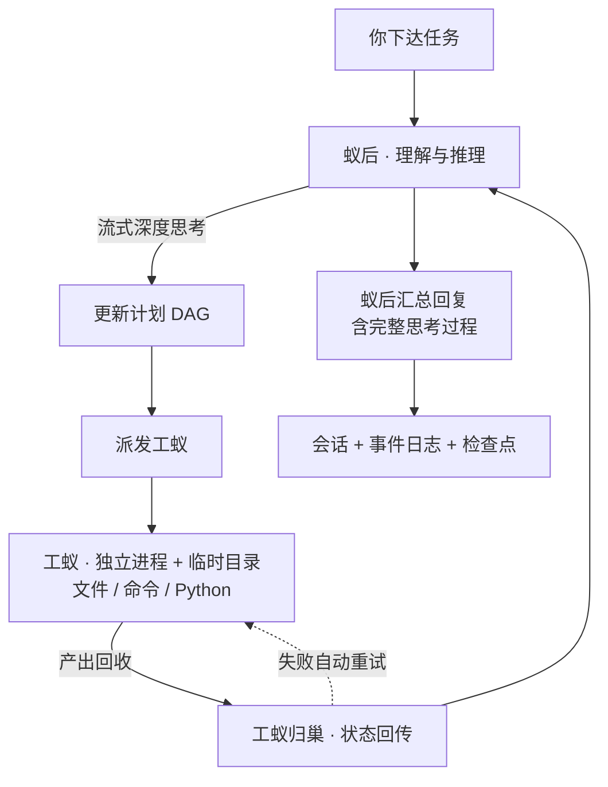
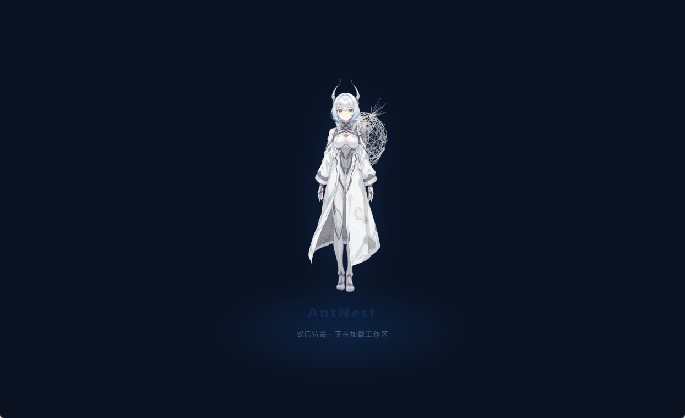
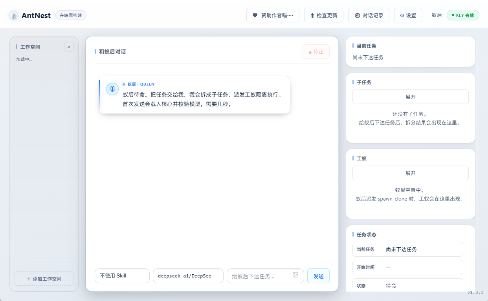
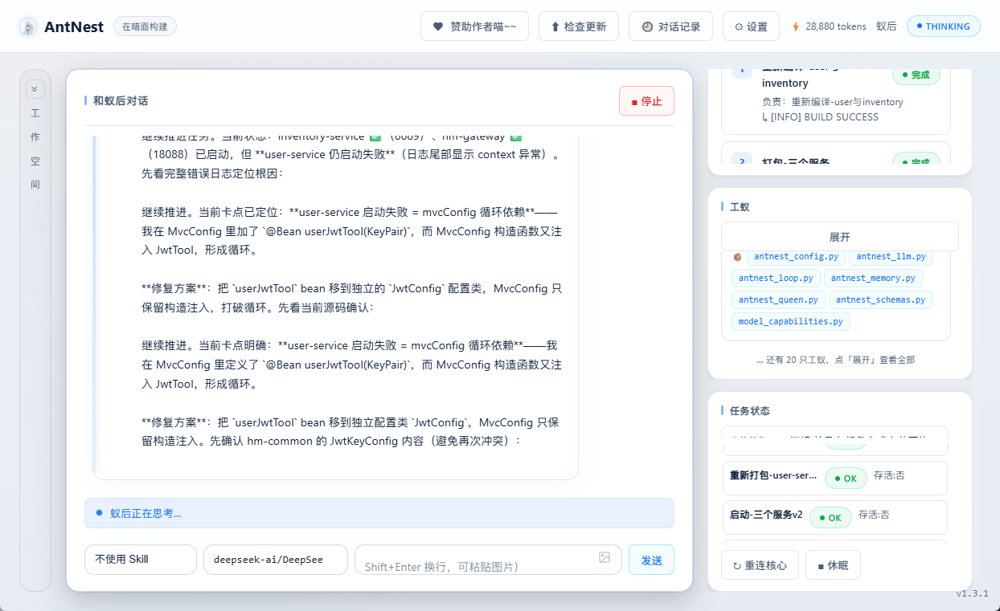

<div align="center">


# AntNest · 蚁巢

**一个真正住在你电脑里的桌面级 AI Agent —— 不是聊天窗口，是会干活的手**

[](https://github.com/llxpy/AntNest/releases)
[](https://github.com/llxpy/AntNest/actions)
[](https://github.com/llxpy/AntNest)
[](https://github.com/llxpy/AntNest)
[](LICENSE)
[](https://www.python.org/)
[](https://github.com/llxpy/AntNest/releases)

[⬇️ 下载安装包](https://github.com/llxpy/AntNest/releases) · [🚀 快速开始](#-快速开始) · [🧩 核心能力](#-核心能力) · [🆚 与 OpenClaw 的分野](#-与-openclaw-的分野)

</div>

---

## 📌 这是什么

**AntNest（蚁巢）是一个跑在你自己电脑上的桌面级 AI Agent。**

你给它一句话，它拆解任务、派出工蚁在隔离环境里真正动手操作你的电脑——读文件、改代码、跑命令、调 MCP、查网络——然后带着产出回来，由蚁后汇总成一份结论。

不是聊天玩具。**是干活的手。**

```powershell
你：「读一下 src/ 里所有 TODO，按影响面排序，标出哪些其实已经不用管了」
    ↓
蚁后流式思考：先摸清项目结构 → 判断哪些 TODO 已过期 → 定排序口径
    ↓
工蚁 1：grep 全仓 TODO          工蚁 2：读 src/ 上下文     工蚁 3：查 git blame
    ↓
工蚁归巢 → 蚁后汇总：一份分好优先级、标注了失效项的清单
```

---

## 🆚 与 OpenClaw 的分野

两者都想做「你自己的 AI 助手」，但切入点不同。

**OpenClaw** 的答案是**渠道**：一个自托管 Gateway，把助手送进你已经在用的 29 个聊天软件（WhatsApp / Telegram / Discord / Slack / iMessage / Signal…）。它的强项是「随处可达」。

**AntNest** 的答案是**桌面深度**：一个原生 Windows 桌面应用，把重心放在「在这台电脑上把复杂活干完、并且让你全程看得见」。

| | OpenClaw | AntNest |
|---|---|---|
| **形态** | 自托管 Gateway + 浏览器 Dashboard / 各端 App | 原生 Windows 桌面应用（pywebview） |
| **触达方式** | 29+ 聊天渠道，随时随地 | 专注本机，桌面常驻 |
| **平台** | macOS / Linux / Windows / iOS / Android | **目前仅 Windows** |
| **多智能体** | 单一 Agent + 插件 | **蚁后 / 工蚁两级架构**：任务拆解 → 独立进程隔离执行 → 产出回收归巢 |
| **思考过程** | 流式输出 | **逐字实时可见**，任务结束后仍可回看蚁后每一步决策依据 |
| **执行可观测** | 会话与事件 | **结构化事件日志 + 任务回放**：每一步工具调用、权限判定、计划变更全部落盘可重演 |
| **中断恢复** | 会话持久化 | **检查点续跑**：强停后保存决策摘要，下一轮先理解「为什么停」再继续；任务检查点可重新水合 |
| **权限模型** | 命令 allow/deny 策略 | **L0–L5 分级 + 作用域授权**：批准改一个文件 ≠ 批准改整个仓库；改自身源码永远需人确认 |
| **运行时依赖** | Node.js 24/26 | **仅 `pywebview`**，其余全标准库 |

**如果你需要「在 Telegram 里指挥它」** → OpenClaw 更合适。
**如果你要「让它在这台机器上把一个真实的代码工程/系统任务做完，并且你看得见每一步」** → AntNest。

---

## 🏗 架构：为什么是「蚁后 / 工蚁」


```mermaid
flowchart TD
    A[你下达任务] --> B[蚁后 · 理解与推理]
    B -->|流式深度思考| C[更新计划 DAG]
    C --> D[派发工蚁]
    D --> E[工蚁 · 独立进程 + 临时目录<br/>文件 / 命令 / Python]
    E -->|产出回收| F[工蚁归巢 · 状态回传]
    F --> B
    F -.失败自动重试.-> E
    B --> G[蚁后汇总回复<br/>含完整思考过程]
    G --> H[会话 + 事件日志 + 检查点]
```

| 角色 | 职责 | 隔离 |
|---|---|---|
| **蚁后** | 理解任务 → 推理拆解 → 维护计划 DAG → 派发决策 → 汇总回复 | 主进程，**不直接执行命令** |
| **工蚁** | 在隔离目录执行文件 / 命令 / Python，产出后销毁归巢 | 独立进程 + 临时目录，退出即回收 |

分工带来四件事：

- **安全** —— 危险命令正则过滤；工蚁只在临时巢穴动土，不碰你的工作目录
- **并行** —— 一层最多 10 只工蚁，层级 2 → 5 → 3 递减
- **恢复** —— 失败自动重试；强停保存决策摘要，下一轮先理解「为什么停」
- **可查** —— 每个工蚁的任务状态、耗时、产出都留在事件日志里，事后可完整回放

---

## ✨ 核心能力

### 🧠 深度思考 · 全程可见

- 任务进行中**实时流式显示蚁后的推理过程**（逐字填充，小卡片内滚动）
- 每条回复永久保留思考链，事后回看「它当时为什么这么决定」
- **失败会说出具体原因**：捕获 `finish_reason` 区分「被 token 上限截断」「被内容策略拦截」「服务端资源不足」，而不是笼统一句「没有回复」
- 模型能力画像按 `/models` **实测校准**上下文上限并注入系统提示词

### 👑 多智能体调度

- `spawn_clone` 派工蚁在隔离环境执行，产出自动收回归档
- 计划以 **DAG** 登记，UI 实时可见；含环的计划**整体拒绝**而不是留半份
- 计划双数据源：LLM 显式调用 + 从 `spawn_clone` 自动派生（模型不按格式调工具时的兜底）
- **权限闸门先于计划派生** —— 被拒绝的 spawn 不会在计划里留下节点

### 🛡 L0–L5 权限模型

| 档位 | 能力 |
|---|---|
| L0 | 只读审阅（`view_file` / `list_dir` / `grep_files`） |
| L2 | 执行（`run_cli` / `run_python` / `spawn_clone`） |
| L3 | 网络（`web_fetch` / `mcp_*`）+ 写入 |
| L5 | 改自身源码 —— **永远需要人确认** |

- 三态决策：`ALLOW` / `ASK` / `DENY`，**未知工具 fail-closed**
- **按作用域签发授权**：`write:<path>`、`cmd:<command>`。批准改一个文件不等于批准改整个仓库
- 参数敏感判定覆盖静态等级：`write_file` 静态是 L1，但 `path` 指向核心源码时结论是 **ASK**

### 🔭 运行时可观测

- **结构化事件日志**（`events/*.jsonl`）：任务、工具、权限、工蚁、检查点全落盘，**可重放**
- 独立 `audit.log` 只记安全事件；思维链内容与凭据**绝不落盘**（强制 redact）
- **任务检查点**：在工具批次闭合的静止点快照，重建消息列表时剔除思维链字段
- 故障时入口会读应用自己的日志，把**真实错误原文 + 日志路径**弹给你，而不是静默退出

### 🧰 17 个内置工具

| 类别 | 工具 |
|---|---|
| **工蚁调度** | `spawn_clone` `get_task_status` |
| **文件** | `view_file` `list_dir` `grep_files` `write_file` `search_replace` |
| **网络 / 扩展** | `web_fetch` `mcp_call` `mcp_list_tools` |
| **自建工具** | `register_tool` `list_tools` `get_tool_source`（用 Python 现写，落地成 Skill） |
| **计划 / 记忆** | `update_plan` `leave_memory_hints` |
| **执行（工蚁侧）** | `run_cli` `run_python` |

> 工具清单是**单一真源**（`antnest_registry.TOOL_SPECS`）。执行器、暴露给模型的 schema、提示词目录全部由它派生 —— 加一个工具只改一处。

### 🗄 记忆

- **B+ 树思想索引 + RAG 检索**的记忆层（`memory_tree.py`）
- 每轮自动检索 `NEST.md` / `hints.md` 相关段落注入上下文
- 动态用户画像、行为偏好、停止快照，跨会话持续演进

### 👴 Agent 自律

- 连续 3 次相同工具 + 相同参数 → 注入**《自我反思》**指引换一种方法，不卡死
- thinking 重复自动打断擦除；单任务轮次兜底；工具调用格式错误自动纠正
- 上下文接近上限时自动压缩，并留下可检索的记忆线索

### 🎨 桌面体验

- 原生 frameless 窗口，顶栏拖拽，**零黑框**（子进程全部隐藏启动）
- 主题：黑 / 白 / 自定义，统一设计 token
- 右下结构化任务状态卡；子任务与工蚁面板、事件时间线、权限判定实时上屏
- 左侧工作空间栏：常用目录、点击预览文件、一键切换（可折叠）
- 对话记录：只读回看（含思考链）、恢复上下文、删除
- 顶栏直接切换模型；输入栏切换 Skill

---

## 📸 界面预览

<p align="center">
  
  <br/>
  
  <br/>
  
</p>

---

## 🚀 快速开始

### 方式一：安装包（推荐）

从 [**Releases**](https://github.com/llxpy/AntNest/releases) 下载 `AntNest-Setup.exe`，单用户安装到 `%LOCALAPPDATA%\AntNest`，**无需管理员权限**。首次运行自动拉取依赖（需联网一次）。

### 方式二：源码运行

```bash
git clone https://github.com/llxpy/AntNest.git
cd AntNest
uv run python prototype_antnest.py
```

### 方式三：仓库内直接启动

双击根目录的 `AntNest.exe`（已编译的 GUI 启动器，零配置）。

> **首次使用**：打开「⚙ 设置」填入 API Base URL / 模型 / Key，点「保存并校验」，即可开始下达任务。
>
> 仓库根目录没有 `AntNest.exe` 时，用 `installer\build_launcher.ps1` 从 `installer\antnest_boot.ps1` 重新编译（需要 PowerShell 的 ps2exe 模块）。

---

## 🔌 支持的模型服务

| 服务 | 说明 |
|---|---|
| **DeepSeek** | 深度思考（reasoning）原生支持 |
| **MiniMax / Kimi** | 参数推荐与上下文预压缩已适配 |
| **OpenAI** | 标准接口 |
| **Ollama / 本地端点** | 任意 OpenAI 兼容服务 |

模型能力（上下文上限、是否支持图片等）在首次会话前按 `/models` **实测校准**，不是猜的。也可在设置里关掉（`api.skip_model_check`）。

---

## 🛡 安全模型

| 层 | 保护 |
|---|---|
| 权限分级 | L0–L5 三态决策，作用域授权，未知工具 fail-closed |
| 改自身源码 | 永远需人确认（`explicit_confirm` 优先于等级判定） |
| 命令过滤 | 正则拦截危险模式（递归删除 / 格式化 / 关机…） |
| 工蚁隔离 | 独立进程 + 临时目录，退出即回收 |
| 凭据隔离 | API Key 存独立 `*.key` 文件（0600），`config.json` 不落明文 |
| 审计 | 全部命令落 `ui_trace.log`；安全事件落 `audit.log` |
| 思维链 | **不落盘** —— 事件日志与检查点强制剥离 `reasoning_content` |

> ⚠️ **进程级隔离，不是容器沙箱。** 危险模式过滤是正则提示，不是强制控制 ——
> `python x.py` 里藏的 `shutil.rmtree` 拦不到。权限分级是**闸门**，不是**护栏**。
> 请按「它真的能操作我的电脑」来配置权限档位。

---

## 🧪 测试与工程质量

```bash
python -m pytest tests/ -q     # 618 passed, 38 subtests
python -m evals.run            # 24/24 离线 Agent 行为评测
```

- **618 项回归测试** + **24 个离线 Agent 评测用例**，CI 全自动执行
- 评测测的是**运行时管线**（权限是否拦住、计划是否成环、工蚁是否派发、失败是否恢复），不是模型能力
- **模块清单从 import 图派生** —— 工蚁在隔离目录以独立进程运行，依赖清单不可能手写（`python -m antnest_inventory` 自检）
- **打包清单有测试守着** —— 加模块忘了加进安装包，CI 当场失败

---

## 📁 项目结构

```
AntNest/
├── prototype_antnest.py        # 桌面 GUI 定义（约 1.4 万行）
├── phtmlwin.py                 # 轻量 GUI 框架（webview / 浏览器双模式）
├── AntNest.py                  # Agent 壳 + CLI 入口
│
├── antnest_bridge.py           # GUI ↔ 核心适配层（事件订阅 / 流式 / 工具包装）
├── antnest_loop.py             # Agent 主循环（工具派发 / 自我反思 / 结局归因）
├── antnest_llm.py              # LLM 流式调用（finish_reason 捕获 / 重复检测）
├── antnest_queen.py            # 蚁后工具集与命令安全过滤
├── antnest_clone_worker.py     # 工蚁隔离执行系统（叶子模块）
│
├── antnest_registry.py         # 工具单一真源
├── antnest_permissions.py      # L0–L5 权限引擎
├── antnest_events.py           # 结构化事件日志 + 任务回放
├── antnest_plan.py             # 计划 DAG
├── antnest_checkpoint.py       # 任务检查点与消息水合
├── antnest_inventory.py        # 从 import 图派生模块清单
│
├── antnest_config.py           # 配置与系统提示词
├── antnest_config_schema.py    # 配置校验
├── antnest_memory.py           # 记忆管理
├── memory_tree.py              # B+ 树思想索引 + RAG 检索
├── model_capabilities.py       # 模型能力探测与画像注入
├── mcp_client.py               # MCP 集成（stdio / http / sse）
├── antnest_toolforge.py        # 工具/Skill 注册与加载
│
├── ui_assets/                  # 样式 / 脚本 / 蚁后形象 / 截图
├── prompts/                    # queen_system.md（蚁后人格）
├── installer/                  # Inno Setup 安装包 + 启动器构建
├── evals/                      # 离线 Agent 评测
└── tests/                      # 回归测试
```

---

## 🗺 路线图

- [x] 蚁后 / 工蚁两级架构与隔离执行
- [x] 深度思考实时可见
- [x] B+ 树记忆 + RAG 检索
- [x] MCP 工具集成
- [x] v1.4 可靠性：权限分级、事件回放、计划 DAG、检查点、离线评测
- [ ] 跨平台（macOS / Linux）
- [ ] 工蚁真正的并行派发（当前工具调用仍顺序执行）
- [ ] 计划执行与实际进度的自动对账

---

## 🤝 参与

Issue 与 PR 都欢迎。动手前请先读 [`AGENTS.md`](AGENTS.md) —— 里面写清了这个项目的硬约束（工蚁模块必须是叶子、工具清单不得手写、端到端路径必须有测试），以及为什么。

---

## 📄 License

[MIT](LICENSE) — Copyright © 2026 LLXPY

<div align="center">

<sub>Built with </sub>🐜<sub> by ants, for ants.</sub>

</div>
